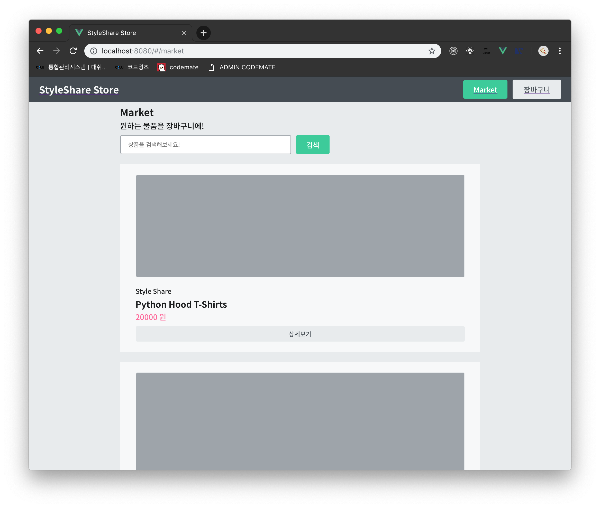
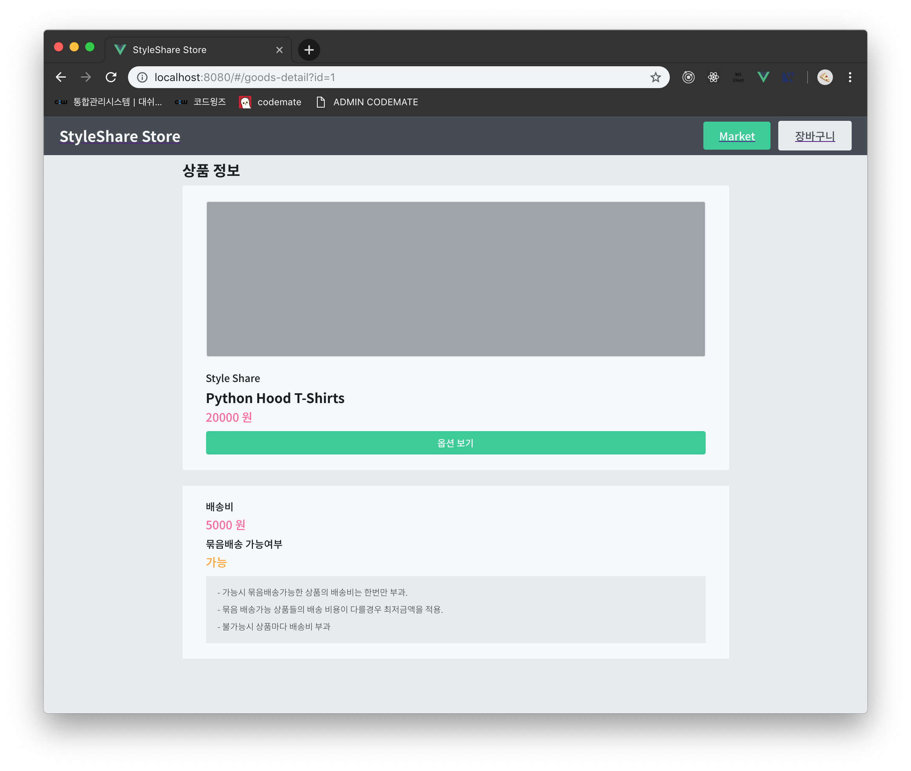
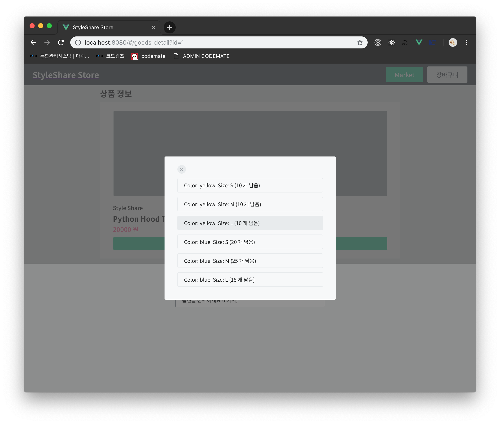
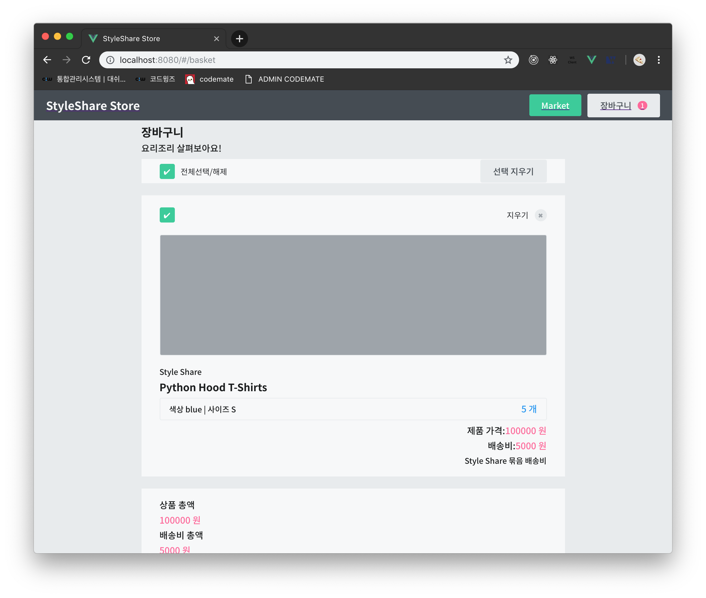

# vue-styleshare

`docker-styleshare` 의 `django-styleshare` 에 RESTful API 로 커뮤니케이션하는 Styleshare store Frontend 입니다.

Vue 와 Webpack 으로 구성된 `vue-cli 3` 를 베이스로 이용하였고, 상태 관리를 위한 `vuex`, 라우팅을 위한 `vue-router`, API call 을 위한 `axios` 등을 이용하였습니다.

## 구현 이미지

## `src` 구성

### `store`
state, Action, Mutation, Getter 들이 정의되어있는 vuex store 입니다. 

### `components`
store 에 접근하지 않는 component 들이 정리되어있습니다.

### `views` 
store 의 Action 과 Getter 를 접근하고 이용하는 Smart Component 들이 정리되어있습니다.

### `layouts`
여러 view(page) 에서 공통적으로 이용되는 레이아웃이 정리되어있습니다.

### `routes` 
라우터의 라우팅 규칙이 정리되어있습니다. 

### `plugins` 
Vue 의 확장성을 부여하는 다양한 plugin 들이 있습니다. 

## local 에 deploy
1. 먼저 `docker-styleshare` repository 에 있는 local 에 deploy 섹션을 읽고, 백엔드를 구동해야합니다.
2. `nodejs` 를 설치합니다. (https://nodejs.org/ko/)
3. `yarn` (패키지 매니져) 을 global에 설치합니다. (https://yarnpkg.com/lang/en/docs/install/#mac-stable)
4. `yarn` 을 실행해 node module 들을 설치합니다. (그냥 명령줄에 `yarn` 한단어... )
5. 이 repository 를 clone 받고, root directory 에서 `yarn run serve` 를 실행합니다. 
6. 브라우저로 `localhost:8080` 으로 접근합니다.

## 여담 : (소소한) `React` 경험

2018년 초, 학교의 Waffle Studio 라는 동아리에서 웹 개발 팀의 Mentor 로 있으면서 Django REST Framework 와 React 를 이용한 프로젝트를 진행했었습니다.

그 때 React 와 관련 생태계 기술을 확실히 공부하고자, custom boilerplate 를 만들기도 하였습니다. (`redux`, `saga` 등을 이용)

https://github.com/shinjayne/custom-react-boilerplate

